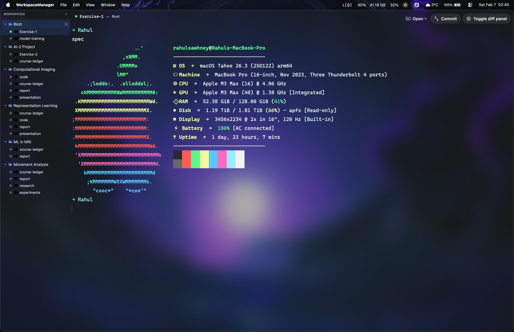
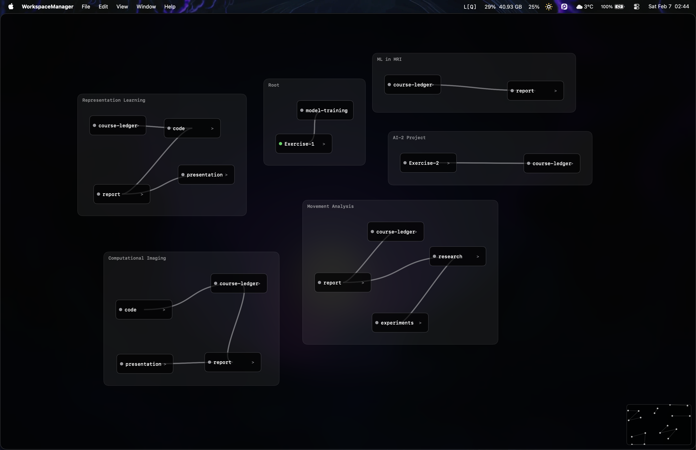

# Workspace Manager

Verification-first terminal orchestration for AI coding agents on macOS.

## Why this exists

Classic tmux panes and flat sidebar trees work until they do not. Once you run multiple workspaces with multiple agent terminals, list-scanning becomes cognitive tax: hard to track context, hard to navigate fast, and hard to preserve confidence in what is running where. Workspace Manager is built to keep orchestration visible, keyboard-efficient, and config-driven without hidden automation.

## Core philosophy

- Verification-first operation.
- Keyboard-first navigation.
- Config-first behavior.
- Explicit state over implicit magic.

## Current capabilities

- Multi-workspace orchestration with persistent TOML config.
- Multiple terminals per workspace with fast selection and cycling.
- Dual terminal rendering paths:
  - GPU path via `GhosttyKit` (Metal-backed).
  - Fallback path via `SwiftTerm`.
- Command palette for workspace/terminal switching and common actions.
- Focus Mode for distraction-free terminal execution.
- Workspace and terminal rename flow from the sidebar.
- Shortcut routing layer with explicit passthrough/consume behavior.
- Secure terminal launch policy:
  - Shell path allowlist.
  - Working-directory safety checks.
  - Sanitized environment propagation.

## Screenshots

### Main workspace view



### Command palette



## Spatial Graph View (flagship roadmap)

Spatial Graph View is the next major leap for this app.

Instead of scanning a list, you navigate a spatial canvas:

- Toggle model: `Sidebar View <-> Graph View`.
- Node model: terminal nodes and markdown nodes.
- Relationship model: containment, references, dependencies, and custom edges.
- Goal: move from list scanning to spatial memory and relationship-aware orchestration.

The current design and phased plan are documented in:

- `docs/spatial-graph-view.md`

## Quickstart

### Requirements

- macOS 14+
- Apple Silicon (current bundled Ghostty binary is arm64)
- Swift 5.9+

### Run (debug by default)

```bash
./scripts/run.sh
```

### Run (release)

```bash
./scripts/run.sh release
```

### Build app bundle manually

```bash
./scripts/build_app_bundle.sh
open Build/WorkspaceManager.app
```

### Verify CI-style checks

```bash
./scripts/ci.sh
```

## Configuration

Config file location:

- `~/.config/workspace-manager/config.toml`

Minimal example:

```toml
[terminal]
font = "Cascadia Code"
font_size = 14
scrollback = 1000000
cursor_style = "bar"
use_gpu_renderer = true

[appearance]
show_sidebar = true
focus_mode = false

[[workspaces]]
id = "11111111-1111-1111-1111-111111111111"
name = "Root"
path = "~/code"
```

## Most-used keybindings

- `Cmd+T` new terminal
- `Shift+Cmd+N` new workspace
- `Cmd+B` toggle sidebar
- `Cmd+P` command palette
- `Cmd+.` toggle Focus Mode
- `Cmd+[` / `Cmd+]` previous/next workspace
- `Cmd+I` / `Cmd+K` previous/next terminal
- `Cmd+R` rename selected workspace/terminal
- `Shift+Cmd+R` reload config
- `Shift+Cmd+/` shortcuts help

## Architecture snapshot

- `Sources/WorkspaceManager/WorkspaceManagerApp.swift`: app lifecycle and window setup.
- `Sources/WorkspaceManager/ContentView.swift`: shell, overlays, and shortcut command dispatch.
- `Sources/WorkspaceManager/Models/AppState.swift`: orchestration state for workspaces/terminals.
- `Sources/WorkspaceManager/Services/ConfigService.swift`: TOML load/save, normalization, and validation.
- `Sources/WorkspaceManager/Views/GhosttyTerminalView.swift`: libghostty integration and input pipeline.
- `Sources/WorkspaceManager/Views/TerminalView.swift`: SwiftTerm fallback terminal path.
- `Sources/WorkspaceManager/Support/KeyboardShortcutRouter.swift`: deterministic shortcut routing.
- `Sources/WorkspaceManager/Support/TerminalLaunchPolicy.swift`: launch hardening policy.

## Known issues

- Modifier-heavy input paths are under active hardening.
- External press-and-hold command-trigger tools can be inconsistent in focused terminal contexts on some setups.
- If input instability appears, run with diagnostics and reproduce using:
  - `WM_DIAGNOSTICS=1 ./scripts/run.sh`
  - `./scripts/repro_input_stress.sh`

## Roadmap

### Knowledge Workspace (next major direction)

The app solves the knowledge work bottleneck for research engineers who juggle multiple git worktrees, read research papers while coding, and constantly switch between AIML/PyTorch projects.

Three high-value features, in priority order:

1. **PDF/Paper Viewer Panel** — Side panel for reading research papers inline next to the terminal. Zero context-switching between Preview and code.
2. **Git Worktree Orchestration** — First-class worktree awareness: visualize branches, fast-switch between worktrees, auto-create workspace+terminal per worktree.
3. **Code Viewer Panel** — Read-only source file viewer with syntax highlighting. Quick reference without leaving the app.

Design filter: if a feature can already be done efficiently via the terminal, it is skipped. Only high-value problems that reduce context-switching are worth building.

Full design rationale: `docs/knowledge-workspace-roadmap.md`

### Spatial Graph phases

- Phase 1: graph canvas foundation (nodes, edges, pan/zoom, persisted positions).
- Phase 2: knowledge layer (wikilinks, context-aware node relationships).
- Phase 3: agent orchestration layer (dependency-aware workflows).
- Phase 4: advanced interaction and timeline evolution.

## Contributing

- Branch naming convention: `ghost/<topic>`.
- Keep changes focused and reviewable.
- Run checks before pushing:
  - `./scripts/ci.sh`
- Include reproduction steps for bug fixes, especially for keyboard/input changes.

## Status

Active development. Spatial Graph View is planned and intentionally scoped for phased delivery.
